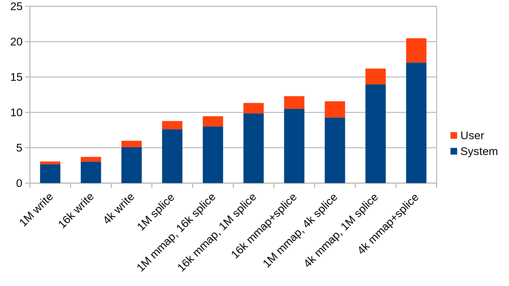

# splice-write-benchmark

Benchmark performance of writing pages filled with memset into socket. Uses a buffer of total size 1 MB, split into `vecs_count` subblocks (tunable by `vecs_count_order`), each subblock optionally being handled by a separate call to write/splice/mmap/memset.

When `WRITE = true`, buffer is statically allocated, for each subblock a separate call to `memset()` and `write()` is performed on each iteration.

When `WRITE = false`, `vmsplice()+splice()` are employed to write into socket. The buffer is gifted, so the new buffer is `mmap`-ed on each iteration.  
When `LARGE_MMAP = true`, the 1 MB buffer is `mmap`-ed as a whole, while for `LARGE_MMAP = false` the `mmap()` is called for each subblock.  
Same goes for `LARGE_VECIO`: `true` - `vmsplice()` and `splice()` are called for 1 MB bufer, `false` - they are called for each subblock. `LARGE_MMAP = true` and `LARGE_VECIO = true` effectively mean absence of subblocks (`vecs_count_order = 0`).

Build with `make`, run as `./run`.

This program plays a role of server, thus requiring some client to connect to it, e.g.

```
while ! netcat 127.0.0.1 5000 > /dev/null ; do sleep 1 ; done
```

My results (Intel(R) Core(TM) i5-6600 CPU @ 3.30GHz, Y-axis in second, less is better):



Single 1M block splice
```
	Command being timed: "./run"
	User time (seconds): 1.17
	System time (seconds): 7.61
	Percent of CPU this job got: 83%
	Major (requiring I/O) page faults: 0
	Minor (reclaiming a frame) page faults: 5120077
	Voluntary context switches: 3
	Involuntary context switches: 173
```

64x16k blocks mmap, 1M splice
```
	Command being timed: "./run"
	User time (seconds): 1.48
	System time (seconds): 9.85
	Percent of CPU this job got: 89%
	Major (requiring I/O) page faults: 0
	Minor (reclaiming a frame) page faults: 5120073
	Voluntary context switches: 3
	Involuntary context switches: 78
```

1M mmap, 64x16k blocks splice
```
	Command being timed: "./run"
	User time (seconds): 1.44
	System time (seconds): 8.01
	Percent of CPU this job got: 87%
	Major (requiring I/O) page faults: 0
	Minor (reclaiming a frame) page faults: 5120072
	Voluntary context switches: 15
	Involuntary context switches: 799
```

64x16k blocks mmap and splice
```
	Command being timed: "./run"
	User time (seconds): 1.79
	System time (seconds): 10.50
	Percent of CPU this job got: 88%
	Elapsed (wall clock) time (h:mm:ss or m:ss): 0:13.90
	Major (requiring I/O) page faults: 0
	Minor (reclaiming a frame) page faults: 5120075
	Voluntary context switches: 3
	Involuntary context switches: 244
```

256x4k blocks mmap, 1M splice
```
	Command being timed: "./run"
	User time (seconds): 2.24
	System time (seconds): 13.95
	Percent of CPU this job got: 91%
	Major (requiring I/O) page faults: 0
	Minor (reclaiming a frame) page faults: 5120073
	Voluntary context switches: 12
	Involuntary context switches: 658
```

1M mmap, 256x4k blocks splice
```
	Command being timed: "./run"
	User time (seconds): 2.31
	System time (seconds): 9.26
	Percent of CPU this job got: 86%
	Major (requiring I/O) page faults: 0
	Minor (reclaiming a frame) page faults: 5120075
	Voluntary context switches: 3
	Involuntary context switches: 86
```

256x4k blocks mmap and splice
```
	Command being timed: "./run"
	User time (seconds): 3.45
	System time (seconds): 17.03
	Percent of CPU this job got: 95%
	Major (requiring I/O) page faults: 0
	Minor (reclaiming a frame) page faults: 5120077
	Voluntary context switches: 4
	Involuntary context switches: 141
```

Single 1M block write
```
	Command being timed: "./run"
	User time (seconds): 0.39
	System time (seconds): 2.67
	Percent of CPU this job got: 42%
	Major (requiring I/O) page faults: 0
	Minor (reclaiming a frame) page faults: 328
	Voluntary context switches: 8056
	Involuntary context switches: 35
```

64x16k blocks write
```
	Command being timed: "./run"
	User time (seconds): 0.68
	System time (seconds): 3.03
	Percent of CPU this job got: 51%
	Major (requiring I/O) page faults: 0
	Minor (reclaiming a frame) page faults: 330
	Voluntary context switches: 8570
	Involuntary context switches: 86
```

256x4k blocks write
```
	Command being timed: "./run"
	User time (seconds): 0.90
	System time (seconds): 5.08
	Percent of CPU this job got: 85%
	Elapsed (wall clock) time (h:mm:ss or m:ss): 0:07.00
	Major (requiring I/O) page faults: 0
	Minor (reclaiming a frame) page faults: 328
	Voluntary context switches: 4
	Involuntary context switches: 450
```

Maximum resident set size 2100-2500 kb across all cases.


